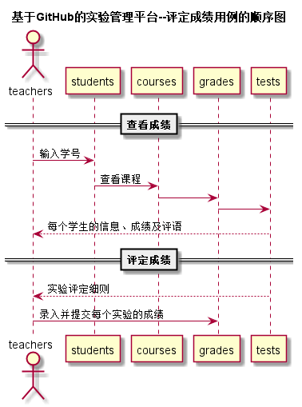

# “评定成绩”用例 [返回](../README.md)
## 1. 用例规约

|用例名称|评定成绩|
|-------|:-------------|
|功能|老师为一个学生实验评定成绩|
|参与者|老师|
|前置条件|查看成绩：评定成绩之前，老师需要先登录，进入评定成绩页面，并显示出一个学生评定过的的所有实验成绩和评语信息|
|后置条件|老师在根据系统给出的评分细则进行评分，评定成绩提交之后，系统自动设置成绩更新日期为当前日期，自动计算平均成绩|
|主事件流|1. 查看已有的成绩   2.查看实验评分细则   3. 输入一个或者多个实验的成绩和评语   4. 提交  5. 系统存储实验成绩和评语  6. 系统自动计算平均成绩 |
|备选事件流| 2a. 成绩必须是0至100之间，可以为空，但不能超界   1.提示用户重新输入成绩分数|

## 2. 业务流程（顺序图）[源码](../src/sequence评定成绩.puml)
 

## 3. 界面设计
- 界面参照: [评定成绩界面](../ui/add_grades.html)
- API接口调用
    - 接口1：[getNextPrevStudent](../接口/getNextPrevStudent.md)   用于取得上一个或下一个学号的学生
    - 接口2：[getOneStudentResults](../接口/getOneStudentResults.md)   用于显示一个学生的所有成绩和评语
    - 接口3：[setOneStudentResults](../接口/setOneStudentResults.md)   用于设置一个学生的成绩及评语接口
    
## 4. 算法描述
   - 无
   
## 5. 参照表
   - [STUDENTS](../DesignDatabase.md/#STUDENTS)
   - [GRADES](../DesignDatabase.md/#GRADES)
   - [TESTS](../DesignDatabase.md/#TESTS)
